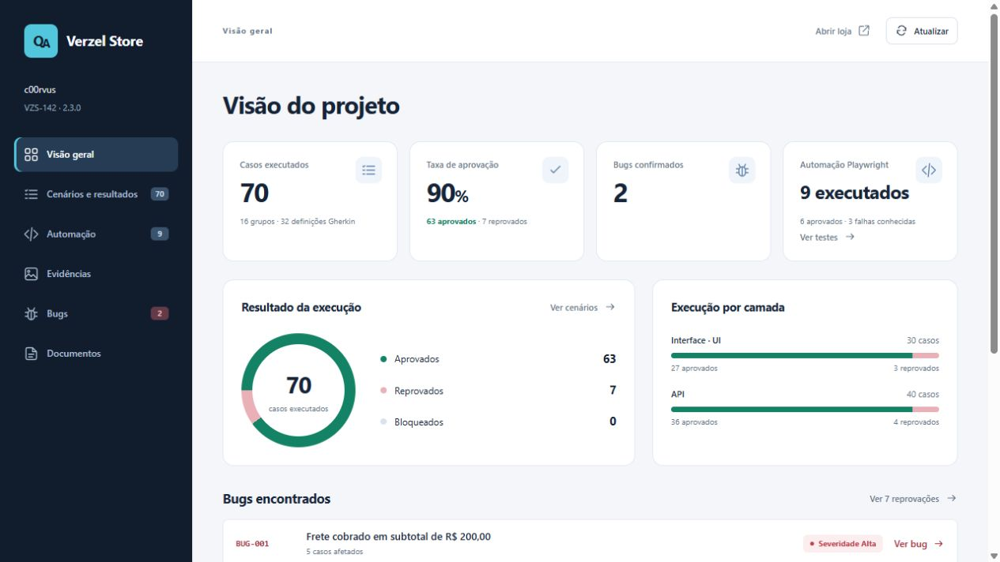

# QA · Verzel Store

Testes de carrinho, cupons, frete e checkout na interface e na API. Card **VZS-142**, versão **2.3.0**.

[Acessar dashboard](https://c00rvus.github.io/verzel-store/) — resultados, bugs, evidências e código dos testes, sem instalação.



## Resultados

| Testes manuais e exploratórios | Executados | Aprovados | Reprovados |
| --- | ---: | ---: | ---: |
| Interface | 30 | 27 | 3 |
| API | 40 | 36 | 4 |
| **Total** | **70** | **63** | **7** |

**2 bugs confirmados.** Automação: **9 testes**, com **6 aprovados e 3 falhas conhecidas esperadas**, sem falhas inesperadas na execução registrada de 07/10/2026.

## Entregas

| Material | Arquivo |
| --- | --- |
| Cenários e rastreabilidade dos requisitos | [cenarios.md](docs/cenarios.md) |
| Especificações Gherkin | [docs/gherkin/](docs/gherkin/) |
| Resultados manuais e sessão exploratória | [execucao.md](docs/execucao.md) |
| Relatório de bugs | [bugs.md](docs/bugs.md) |
| Evidências da execução | [evidencias.md](docs/evidencias.md) |
| Automação Playwright | [tests/](tests/) |

Ambiente: [loja](https://verzel-store.qa-test-verzel-store.workers.dev/) e [documentação](https://verzel-store.qa-test-verzel-store.workers.dev/documentacao).

## Executar a automação

Requisitos: **Node.js 22+**, npm e acesso à internet. Na raiz do projeto:

```powershell
npm ci
npm run test:install
npm test
```

Os testes usam Chromium, dois processos em paralelo e contextos isolados. Não exigem login, credenciais ou servidor local.

```powershell
npm run test:report
```

O relatório inclui etapas, capturas e respostas da API. Para acompanhar a execução, use `npm run test:headed` ou `npm run test:ui`.

### Organização dos testes

- [carrinho.spec.ts](tests/carrinho.spec.ts): cupons, frete, quantidade e recálculo.
- [checkout.spec.ts](tests/checkout.spec.ts): CEP inválido e confirmação de pedido com cupom.
- [limite-api.spec.ts](tests/limite-api.spec.ts): limite de quantidade no cálculo e na criação de pedidos.

As ações e locators ficam em `tests/pages/`; o cliente, os dados e as validações da API ficam em `tests/api/`. `npm test` executa os arquivos `.spec.ts`; os `.feature` documentam os cenários.

### Bugs conhecidos

AUTO-005 reproduz o **BUG-001**; AUTO-008 e AUTO-009 reproduzem o **BUG-002**. Os testes mantêm a validação do requisito e marcam a falha como esperada apenas quando o comportamento corresponde ao bug registrado. Falhas esperadas aceitas pelo Playwright não são aprovações funcionais.

Se ocorrer erro de certificado no Windows, use Node.js 22.19+ e execute `$env:NODE_USE_SYSTEM_CA='1'` no mesmo terminal antes de repetir os comandos.

## Dashboard local (opcional)

```powershell
node dashboard/build.cjs
node dashboard/serve.cjs
```

Abra [http://127.0.0.1:4174/](http://127.0.0.1:4174/). O dashboard exibe os registros existentes; esses comandos não executam testes.

## Uso de IA

Utilizei IA na análise dos requisitos, elaboração dos cenários, execução e organização dos testes manuais e de API, automação Playwright e criação do dashboard.
