# Evidências

**Datas:** 06 e 07/10/2026. Resultados detalhados em [execução](execucao.md).

## Registros individuais por caso

Cada JSON contém somente o caso identificado, com entrada, esperado, obtido e evidências. Os registros de API incluem apenas a requisição e a resposta daquele caso.

| Caso | Camada | Registro |
| --- | --- | --- |
| CT-001 | UI | [JSON](../evidencias/cenarios/CT-001/registro.json) |
| CT-002-espacos_fim | UI | [JSON](../evidencias/cenarios/CT-002-espacos_fim/registro.json) |
| CT-002-espacos_inicio | UI | [JSON](../evidencias/cenarios/CT-002-espacos_inicio/registro.json) |
| CT-002-letras_e_espacos | UI | [JSON](../evidencias/cenarios/CT-002-letras_e_espacos/registro.json) |
| CT-002-letras_mistas | UI | [JSON](../evidencias/cenarios/CT-002-letras_mistas/registro.json) |
| CT-002-minusculas | UI | [JSON](../evidencias/cenarios/CT-002-minusculas/registro.json) |
| CT-003-UI | UI | [JSON](../evidencias/cenarios/CT-003-UI/registro.json) |
| CT-004-UI | UI | [JSON](../evidencias/cenarios/CT-004-UI/registro.json) |
| CT-005 | UI | [JSON](../evidencias/cenarios/CT-005/registro.json) |
| CT-006-UI-com-cupom | UI | [JSON](../evidencias/cenarios/CT-006-UI-com-cupom/registro.json) |
| CT-006-UI-sem-cupom | UI | [JSON](../evidencias/cenarios/CT-006-UI-sem-cupom/registro.json) |
| CT-007-UI-camiseta-garrafas | UI | [JSON](../evidencias/cenarios/CT-007-UI-camiseta-garrafas/registro.json) |
| CT-007-UI-jaqueta | UI | [JSON](../evidencias/cenarios/CT-007-UI-jaqueta/registro.json) |
| CT-008-UI | UI | [JSON](../evidencias/cenarios/CT-008-UI/registro.json) |
| CT-009-UI | UI | [JSON](../evidencias/cenarios/CT-009-UI/registro.json) |
| CT-010-adicionar-remover | UI | [JSON](../evidencias/cenarios/CT-010-adicionar-remover/registro.json) |
| CT-010-aumentar | UI | [JSON](../evidencias/cenarios/CT-010-aumentar/registro.json) |
| CT-010-diminuir | UI | [JSON](../evidencias/cenarios/CT-010-diminuir/registro.json) |
| CT-011-UI | UI | [JSON](../evidencias/cenarios/CT-011-UI/registro.json) |
| CT-012-UI-01 | UI | [JSON](../evidencias/cenarios/CT-012-UI-01/registro.json) |
| CT-012-UI-02 | UI | [JSON](../evidencias/cenarios/CT-012-UI-02/registro.json) |
| CT-012-UI-03 | UI | [JSON](../evidencias/cenarios/CT-012-UI-03/registro.json) |
| CT-012-UI-04 | UI | [JSON](../evidencias/cenarios/CT-012-UI-04/registro.json) |
| CT-013-UI-cep-nove-digitos | UI | [JSON](../evidencias/cenarios/CT-013-UI-cep-nove-digitos/registro.json) |
| CT-013-UI-cep-sete-digitos | UI | [JSON](../evidencias/cenarios/CT-013-UI-cep-sete-digitos/registro.json) |
| CT-013-UI-cep-vazio | UI | [JSON](../evidencias/cenarios/CT-013-UI-cep-vazio/registro.json) |
| CT-013-UI-email-sem-arroba | UI | [JSON](../evidencias/cenarios/CT-013-UI-email-sem-arroba/registro.json) |
| CT-013-UI-email-vazio | UI | [JSON](../evidencias/cenarios/CT-013-UI-email-vazio/registro.json) |
| CT-013-UI-nome-sem-sobrenome | UI | [JSON](../evidencias/cenarios/CT-013-UI-nome-sem-sobrenome/registro.json) |
| CT-013-UI-nome-vazio | UI | [JSON](../evidencias/cenarios/CT-013-UI-nome-vazio/registro.json) |
| CT-003-API-C | API | [JSON](../evidencias/cenarios/CT-003-API-C/registro.json) |
| CT-003-API-P | API | [JSON](../evidencias/cenarios/CT-003-API-P/registro.json) |
| CT-004-API-C | API | [JSON](../evidencias/cenarios/CT-004-API-C/registro.json) |
| CT-004-API-P | API | [JSON](../evidencias/cenarios/CT-004-API-P/registro.json) |
| CT-006-API-01 | API | [JSON](../evidencias/cenarios/CT-006-API-01/registro.json) |
| CT-006-API-02 | API | [JSON](../evidencias/cenarios/CT-006-API-02/registro.json) |
| CT-009-API-5C | API | [JSON](../evidencias/cenarios/CT-009-API-5C/registro.json) |
| CT-009-API-5P | API | [JSON](../evidencias/cenarios/CT-009-API-5P/registro.json) |
| CT-009-API-6C | API | [JSON](../evidencias/cenarios/CT-009-API-6C/registro.json) |
| CT-009-API-6P | API | [JSON](../evidencias/cenarios/CT-009-API-6P/registro.json) |
| CT-011-API-01 | API | [JSON](../evidencias/cenarios/CT-011-API-01/registro.json) |
| CT-011-API-02 | API | [JSON](../evidencias/cenarios/CT-011-API-02/registro.json) |
| CT-011-API-03 | API | [JSON](../evidencias/cenarios/CT-011-API-03/registro.json) |
| CT-012-API-01 | API | [JSON](../evidencias/cenarios/CT-012-API-01/registro.json) |
| CT-012-API-02 | API | [JSON](../evidencias/cenarios/CT-012-API-02/registro.json) |
| CT-013-API-01 | API | [JSON](../evidencias/cenarios/CT-013-API-01/registro.json) |
| CT-013-API-02 | API | [JSON](../evidencias/cenarios/CT-013-API-02/registro.json) |
| CT-013-API-03 | API | [JSON](../evidencias/cenarios/CT-013-API-03/registro.json) |
| CT-013-API-04 | API | [JSON](../evidencias/cenarios/CT-013-API-04/registro.json) |
| CT-013-API-05 | API | [JSON](../evidencias/cenarios/CT-013-API-05/registro.json) |
| CT-013-API-06 | API | [JSON](../evidencias/cenarios/CT-013-API-06/registro.json) |
| CT-013-API-tres-campos | API | [JSON](../evidencias/cenarios/CT-013-API-tres-campos/registro.json) |
| CT-014-API-P005 | API | [JSON](../evidencias/cenarios/CT-014-API-P005/registro.json) |
| CT-014-API-P999 | API | [JSON](../evidencias/cenarios/CT-014-API-P999/registro.json) |
| CT-014-API-catalogo | API | [JSON](../evidencias/cenarios/CT-014-API-catalogo/registro.json) |
| CT-015-API-01 | API | [JSON](../evidencias/cenarios/CT-015-API-01/registro.json) |
| CT-015-API-02 | API | [JSON](../evidencias/cenarios/CT-015-API-02/registro.json) |
| CT-015-API-03 | API | [JSON](../evidencias/cenarios/CT-015-API-03/registro.json) |
| CT-015-API-04 | API | [JSON](../evidencias/cenarios/CT-015-API-04/registro.json) |
| CT-015-API-05 | API | [JSON](../evidencias/cenarios/CT-015-API-05/registro.json) |
| CT-015-API-06 | API | [JSON](../evidencias/cenarios/CT-015-API-06/registro.json) |
| CT-015-API-07 | API | [JSON](../evidencias/cenarios/CT-015-API-07/registro.json) |
| CT-015-API-08 | API | [JSON](../evidencias/cenarios/CT-015-API-08/registro.json) |
| CT-015-API-09 | API | [JSON](../evidencias/cenarios/CT-015-API-09/registro.json) |
| CT-015-API-10 | API | [JSON](../evidencias/cenarios/CT-015-API-10/registro.json) |
| CT-015-API-11 | API | [JSON](../evidencias/cenarios/CT-015-API-11/registro.json) |
| CT-015-API-12 | API | [JSON](../evidencias/cenarios/CT-015-API-12/registro.json) |
| CT-016-API-json-invalido | API | [JSON](../evidencias/cenarios/CT-016-API-json-invalido/registro.json) |
| CT-016-API-metodo-invalido | API | [JSON](../evidencias/cenarios/CT-016-API-metodo-invalido/registro.json) |
| CT-016-API-rota-inexistente | API | [JSON](../evidencias/cenarios/CT-016-API-rota-inexistente/registro.json) |

Sessão exploratória, fora dos 70 casos: [EXP-01](../evidencias/cenarios/EXP-01/registro.json).

## Arquivo histórico de evidências

| ID | Cenário | Conteúdo | Arquivo |
| --- | --- | --- | --- |
| EV-001 | CT-006, CT-010 | Duas mochilas com cupom; frete indevido em R$ 200,00. BUG-001. | [Captura](../evidencias/revisao-ambiente/frete-subtotal-200-com-cupom.png) |
| EV-002 | CT-006 | API: subtotal R$ 200,00 com e sem cupom. BUG-001. | [JSON](../evidencias/revisao-ambiente/api-limite-frete.json) |
| EV-003 | CT-009 | Cinco mochilas; botão de aumento desabilitado. | [Captura](../evidencias/revisao-ambiente/quantidade-cinco-interface.png) |
| EV-004 | CT-009 | API de cálculo aceita seis mochilas com HTTP 200. BUG-002. | [JSON](../evidencias/revisao-ambiente/quantidade-seis-api.json) |
| EV-005 | CT-012 | Pedido fictício VZ-829857; cupom, CEP com hífen e total R$ 109,90. | [Captura](../evidencias/revisao-ambiente/pedido-confirmado-dados-validos.png) |
| EV-006 | CT-003, CT-004, CT-007 a CT-009, CT-011 a CT-016 | Requisições e respostas da revisão: método, rota, dados, status e timestamps UTC. | [JSON](../evidencias/revisao-ambiente/api-observacoes-powershell.json) |
| EV-007 | CT-002 — minúsculas | 15:02; BEMVINDO10 ativo; subtotal R$ 100,00 e total R$ 109,90. | [Captura](../evidencias/CT-002-minusculas.png) |
| EV-008 | CT-002 — letras mistas | 15:15; BeMvInDo10 aceito e normalizado; total R$ 109,90. | [Antes/depois](../evidencias/CT-002-letras-mistas.png) |
| EV-009 | CT-002 — espaços externos | 15:22; espaços iniciais e finais aceitos; total R$ 109,90 em ambos. | [Montagem](../evidencias/CT-002-espacos-vazios.png) |
| EV-010 | CT-005 — remoção e reaplicação | 16:05; total R$ 119,90 sem cupom e R$ 109,90 após reaplicar. | [Montagem](../evidencias/CT-005-remover-reaplicar.png) |
| EV-011 | CT-006 — com cupom | 16:30; frete R$ 19,90 e total R$ 199,90. Captura original indisponível; condição equivalente na EV-001. | [Registro](execucao.md) |
| EV-012 | CT-006 — sem cupom | 16:30; frete R$ 19,90 e total R$ 219,90. BUG-001. | [Captura](../evidencias/CT-006-frete-200-sem-cupom.png) |
| EV-013 | CT-007 — jaqueta com cupom | 16:39; subtotal R$ 229,90, desconto R$ 22,99, frete grátis e total R$ 206,91. | [Captura](../evidencias/CT-007-jaqueta-com-cupom.png) |
| EV-014 | CT-007 — camiseta e garrafas com cupom | 16:58; subtotal R$ 209,90, desconto R$ 20,99, frete grátis e total R$ 188,91. | [Captura](../evidencias/CT-007-subtotal-209-90-com-cupom.png) |
| EV-015 | CT-008; CT-011 UI | 17:03; subtotal R$ 199,90, desconto R$ 19,99, frete R$ 19,90, total R$ 199,81 e faltante R$ 0,10. Valores com duas casas decimais. | [Captura](../evidencias/CT-008-subtotal-199-90-com-cupom.png) |

## UI em 07/10/2026

**Método:** execução pela interface. Capturas antes e depois das ações; timestamps UTC no manifesto.

## EV-016

**CT-001 — aplicação do cupom.**

Comparativo e etapas

**CT-001 — Aprovado.** 07/10 10:16:46 (UTC-04:00).

| Antes da ação | Depois da ação |
| --- | --- |
|  |  |

| Etapa | Data e hora | Captura |
| --- | --- | --- |
| Vitrine com carrinho vazio | 07/10 10:15:13 | [CT-001-vitrine-antes-adicionar.png](../evidencias/execucao-2026-10-07/CT-001-vitrine-antes-adicionar.png) |
| Uma mochila adicionada | 07/10 10:15:14 | [CT-001-vitrine-depois-adicionar.png](../evidencias/execucao-2026-10-07/CT-001-vitrine-depois-adicionar.png) |
| Resumo completo sem cupom | 07/10 10:16:06 | [CT-001-cupom-antes.png](../evidencias/execucao-2026-10-07/CT-001-cupom-antes.png) |
| BEMVINDO10 preenchido antes de aplicar | 07/10 10:16:06 | [CT-001-cupom-preenchido.png](../evidencias/execucao-2026-10-07/CT-001-cupom-preenchido.png) |
| Cupom aplicado e resumo recalculado | 07/10 10:16:07 | [CT-001-cupom-depois.png](../evidencias/execucao-2026-10-07/CT-001-cupom-depois.png) |

## EV-017

**CT-002 — espaços e letras mistas.**

Comparativo e etapas

**CT-002-espacos_inicio — Aprovado.** 07/10 10:16:47 (UTC-04:00).

| Antes da ação | Depois da ação |
| --- | --- |
|  |  |

| Etapa | Data e hora | Captura |
| --- | --- | --- |
| Uma mochila sem cupom | 07/10 10:16:47 | [CT-002-espacos-inicio-antes.png](../evidencias/execucao-2026-10-07/CT-002-espacos-inicio-antes.png) |
| Dois espaços antes de BEMVINDO10 | 07/10 10:16:47 | [CT-002-espacos-inicio-preenchido.png](../evidencias/execucao-2026-10-07/CT-002-espacos-inicio-preenchido.png) |
| Cupom com espaços iniciais aceito | 07/10 10:16:47 | [CT-002-espacos-inicio-depois.png](../evidencias/execucao-2026-10-07/CT-002-espacos-inicio-depois.png) |

**CT-002-espacos_fim — Aprovado.** 07/10 10:17:18 (UTC-04:00).

| Antes da ação | Depois da ação |
| --- | --- |
|  |  |

| Etapa | Data e hora | Captura |
| --- | --- | --- |
| Carrinho sem cupom | 07/10 10:17:17 | [CT-002-espacos-fim-antes.png](../evidencias/execucao-2026-10-07/CT-002-espacos-fim-antes.png) |
| Entrada exata registrada em JSON | 07/10 10:17:17 | [CT-002-espacos-fim-preenchido.png](../evidencias/execucao-2026-10-07/CT-002-espacos-fim-preenchido.png) |
| Cupom aceito e resumo atualizado | 07/10 10:17:18 | [CT-002-espacos-fim-depois.png](../evidencias/execucao-2026-10-07/CT-002-espacos-fim-depois.png) |

**CT-002-letras_e_espacos — Aprovado.** 07/10 10:17:19 (UTC-04:00).

| Antes da ação | Depois da ação |
| --- | --- |
| 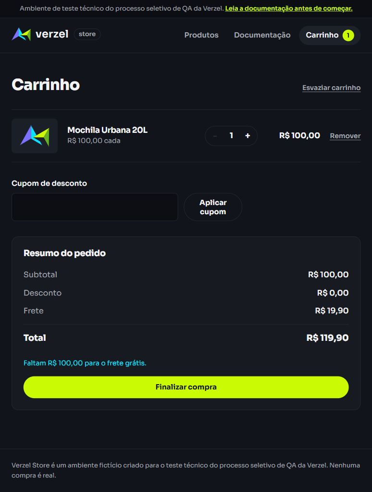 |  |

| Etapa | Data e hora | Captura |
| --- | --- | --- |
| Carrinho sem cupom | 07/10 10:17:18 | [CT-002-letras-espacos-antes.png](../evidencias/execucao-2026-10-07/CT-002-letras-espacos-antes.png) |
| Entrada exata registrada em JSON | 07/10 10:17:18 | [CT-002-letras-espacos-preenchido.png](../evidencias/execucao-2026-10-07/CT-002-letras-espacos-preenchido.png) |
| Cupom aceito e resumo atualizado | 07/10 10:17:19 | [CT-002-letras-espacos-depois.png](../evidencias/execucao-2026-10-07/CT-002-letras-espacos-depois.png) |

## EV-018

**CT-003 — cupom inexistente.**

Comparativo e etapas

**CT-003-UI — Aprovado.** 07/10 10:17:49 (UTC-04:00).

| Antes da ação | Depois da ação |
| --- | --- |
|  | 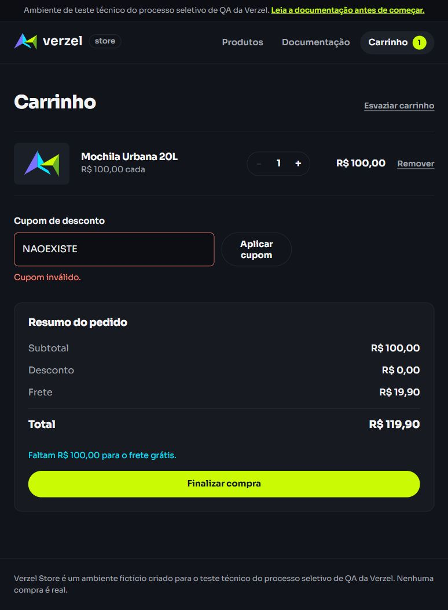 |

| Etapa | Data e hora | Captura |
| --- | --- | --- |
| Uma mochila sem desconto | 07/10 10:17:47 | [CT-003-cupom-antes.png](../evidencias/execucao-2026-10-07/CT-003-cupom-antes.png) |
| Cupom inexistente antes de aplicar | 07/10 10:17:47 | [CT-003-cupom-preenchido.png](../evidencias/execucao-2026-10-07/CT-003-cupom-preenchido.png) |
| Cupom inválido rejeitado | 07/10 10:17:49 | [CT-003-cupom-depois.png](../evidencias/execucao-2026-10-07/CT-003-cupom-depois.png) |

## EV-019

**CT-004 — cupom expirado.**

Comparativo e etapas

**CT-004-UI — Aprovado.** 07/10 10:17:52 (UTC-04:00).

| Antes da ação | Depois da ação |
| --- | --- |
| 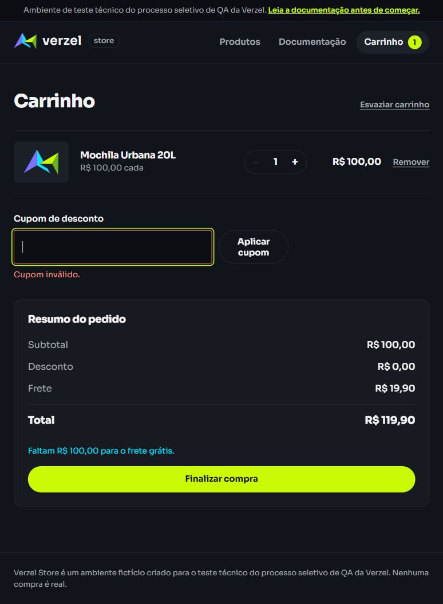 | 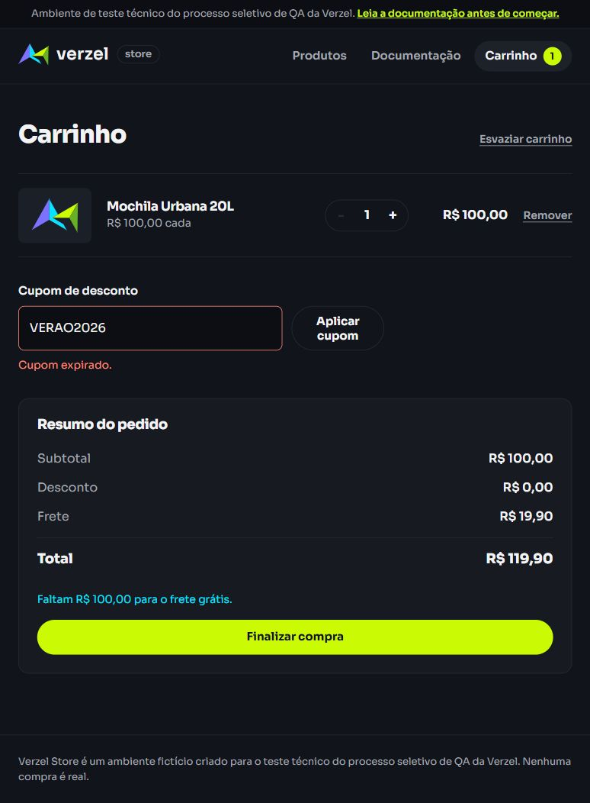 |

| Etapa | Data e hora | Captura |
| --- | --- | --- |
| Carrinho sem cupom expirado | 07/10 10:17:50 | [CT-004-cupom-antes.png](../evidencias/execucao-2026-10-07/CT-004-cupom-antes.png) |
| VERAO2026 antes de aplicar | 07/10 10:17:51 | [CT-004-cupom-preenchido.png](../evidencias/execucao-2026-10-07/CT-004-cupom-preenchido.png) |
| Cupom expirado rejeitado | 07/10 10:17:52 | [CT-004-cupom-depois.png](../evidencias/execucao-2026-10-07/CT-004-cupom-depois.png) |

## EV-020

**CT-009 — limite na interface.**

Comparativo e etapas

**CT-009-UI — Aprovado.** 07/10 10:19:06 (UTC-04:00).

| Antes da ação | Depois da ação |
| --- | --- |
| 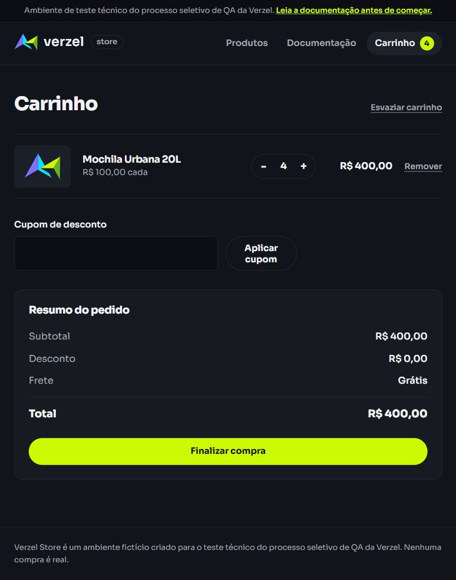 | 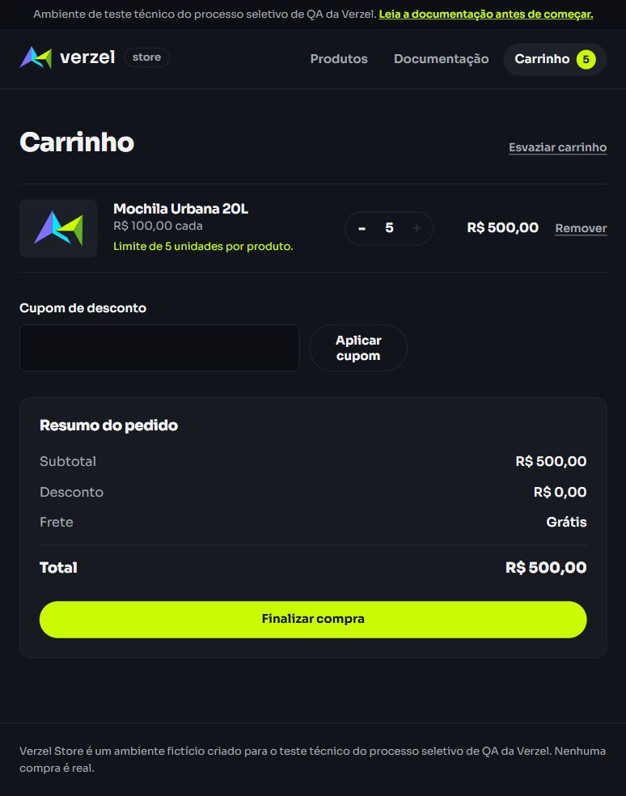 |

| Etapa | Data e hora | Captura |
| --- | --- | --- |
| Quatro mochilas; aumento disponível | 07/10 10:19:05 | [CT-009-quantidade-antes.png](../evidencias/execucao-2026-10-07/CT-009-quantidade-antes.png) |
| Cinco mochilas; aumento bloqueado | 07/10 10:19:06 | [CT-009-quantidade-depois.png](../evidencias/execucao-2026-10-07/CT-009-quantidade-depois.png) |

## EV-021

**CT-010 — aumentar quantidade.**

Comparativo e etapas

**CT-010-aumentar — Reprovado.** 07/10 10:18:19 (UTC-04:00).

| Antes da ação | Depois da ação |
| --- | --- |
|  |  |

| Etapa | Data e hora | Captura |
| --- | --- | --- |
| Uma mochila com cupom | 07/10 10:18:18 | [CT-010-aumentar-antes.png](../evidencias/execucao-2026-10-07/CT-010-aumentar-antes.png) |
| Duas mochilas; frete indevido em R$ 200,00 | 07/10 10:18:19 | [CT-010-aumentar-depois.png](../evidencias/execucao-2026-10-07/CT-010-aumentar-depois.png) |

## EV-022

**CT-010 — diminuir quantidade.**

Comparativo e etapas

**CT-010-diminuir — Aprovado.** 07/10 10:18:19 (UTC-04:00).

| Antes da ação | Depois da ação |
| --- | --- |
| 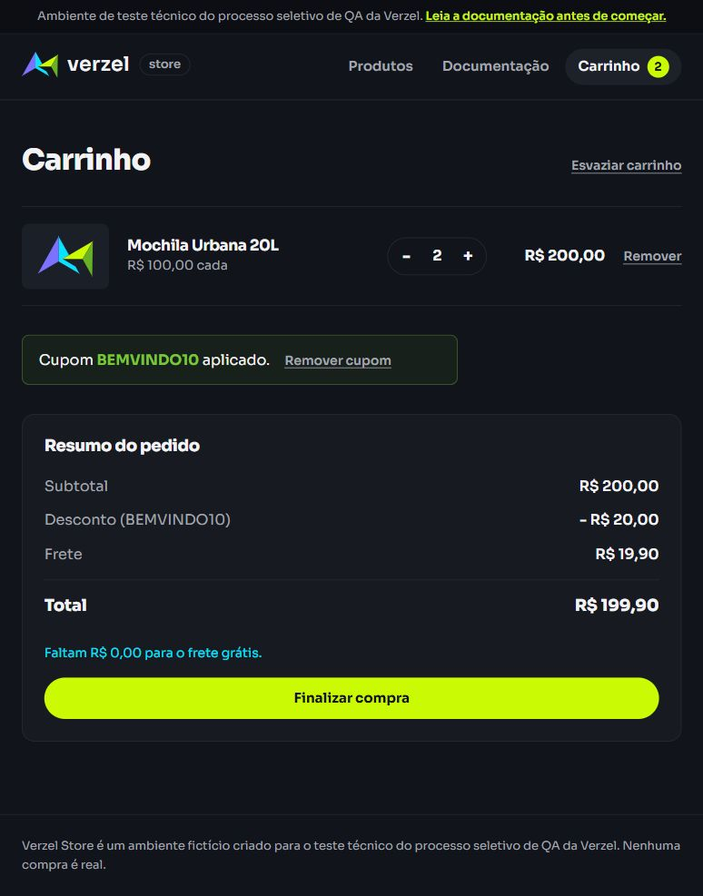 |  |

| Etapa | Data e hora | Captura |
| --- | --- | --- |
| Duas mochilas antes de diminuir | 07/10 10:18:19 | [CT-010-diminuir-antes.png](../evidencias/execucao-2026-10-07/CT-010-diminuir-antes.png) |
| Uma mochila; frete e desconto recalculados | 07/10 10:18:19 | [CT-010-diminuir-depois.png](../evidencias/execucao-2026-10-07/CT-010-diminuir-depois.png) |

## EV-023

**CT-010 — adicionar e remover produto.**

Comparativo e etapas

**CT-010-adicionar-remover — Aprovado.** 07/10 10:18:39 (UTC-04:00).

| Antes da ação | Depois da ação |
| --- | --- |
|  | 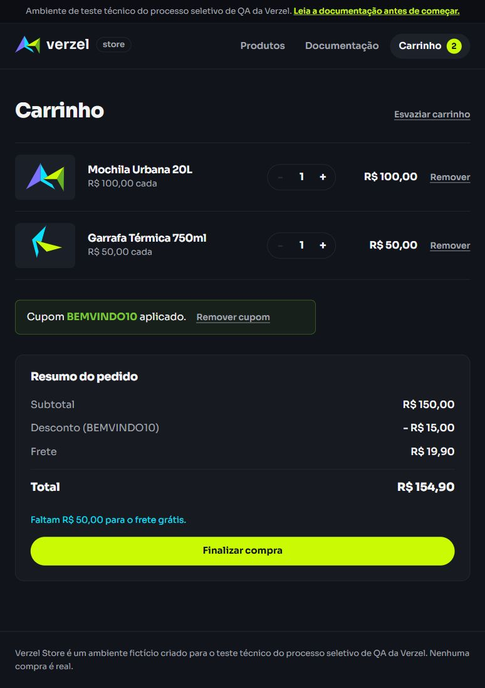 |

| Antes de remover | Depois de remover |
| --- | --- |
|  |  |

| Etapa | Data e hora | Captura |
| --- | --- | --- |
| Resumo antes de adicionar outro produto | 07/10 10:18:19 | [CT-010-adicionar-antes.png](../evidencias/execucao-2026-10-07/CT-010-adicionar-antes.png) |
| Vitrine antes de adicionar a garrafa | 07/10 10:18:37 | [CT-010-vitrine-antes-adicionar.png](../evidencias/execucao-2026-10-07/CT-010-vitrine-antes-adicionar.png) |
| Garrafa adicionada à mochila | 07/10 10:18:38 | [CT-010-vitrine-depois-adicionar.png](../evidencias/execucao-2026-10-07/CT-010-vitrine-depois-adicionar.png) |
| Resumo recalculado com mochila e garrafa | 07/10 10:18:39 | [CT-010-adicionar-depois.png](../evidencias/execucao-2026-10-07/CT-010-adicionar-depois.png) |
| Duas linhas de produtos antes da remoção | 07/10 10:18:39 | [CT-010-remover-antes.png](../evidencias/execucao-2026-10-07/CT-010-remover-antes.png) |
| Resumo recalculado após remover garrafa | 07/10 10:18:39 | [CT-010-remover-depois.png](../evidencias/execucao-2026-10-07/CT-010-remover-depois.png) |

## EV-024

**CT-012-UI-01 — pedido válido.**

Comparativo e etapas

**CT-012-UI-01 — Aprovado.** 07/10 10:19:40 (UTC-04:00).

| Antes da ação | Depois da ação |
| --- | --- |
|  | 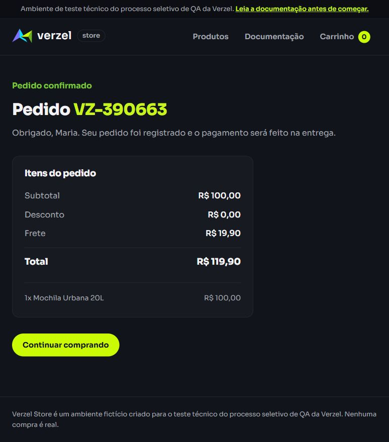 |

| Etapa | Data e hora | Captura |
| --- | --- | --- |
| Uma mochila sem cupom antes do checkout | 07/10 10:19:07 | [CT-012-UI-01-carrinho-antes-checkout.png](../evidencias/execucao-2026-10-07/CT-012-UI-01-carrinho-antes-checkout.png) |
| Checkout vazio e resumo sem cupom | 07/10 10:19:07 | [CT-012-UI-01-checkout-antes-preencher.png](../evidencias/execucao-2026-10-07/CT-012-UI-01-checkout-antes-preencher.png) |
| Dados válidos com CEP com hífen antes de confirmar | 07/10 10:19:40 | [CT-012-UI-01-checkout-depois-preencher.png](../evidencias/execucao-2026-10-07/CT-012-UI-01-checkout-depois-preencher.png) |
| Pedido sem cupom confirmado | 07/10 10:19:40 | [CT-012-UI-01-pedido-depois-confirmar.png](../evidencias/execucao-2026-10-07/CT-012-UI-01-pedido-depois-confirmar.png) |

## EV-025

**CT-012-UI-02 — pedido válido.**

Comparativo e etapas

**CT-012-UI-02 — Aprovado.** 07/10 10:20:08 (UTC-04:00).

| Antes da ação | Depois da ação |
| --- | --- |
|  | 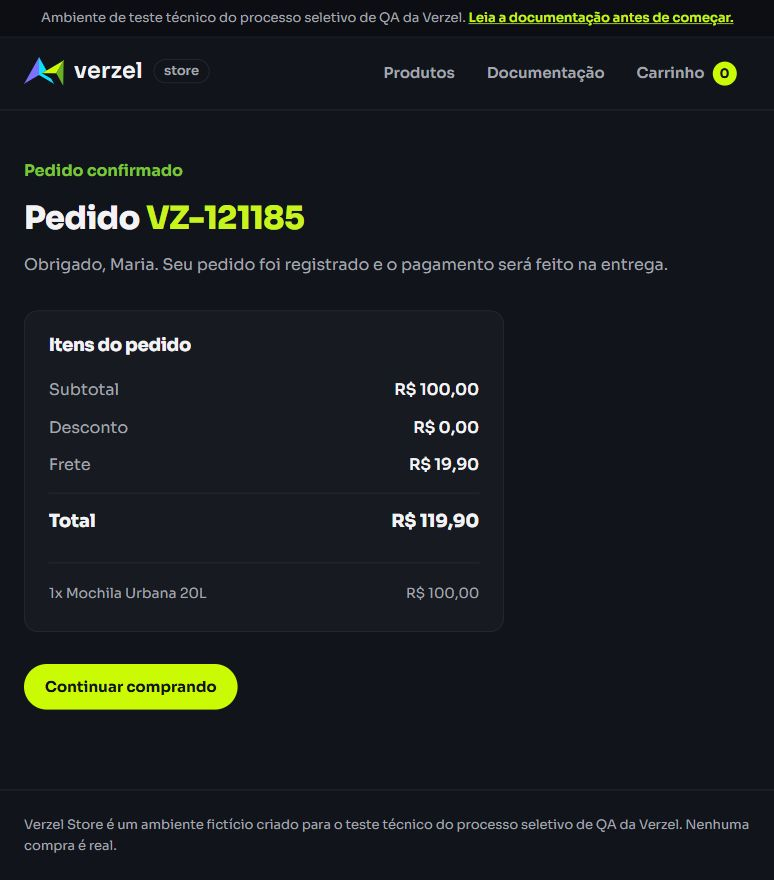 |

| Etapa | Data e hora | Captura |
| --- | --- | --- |
| Resumo antes do checkout | 07/10 10:20:07 | [CT-012-UI-02-carrinho-antes-checkout.png](../evidencias/execucao-2026-10-07/CT-012-UI-02-carrinho-antes-checkout.png) |
| Formulário vazio e resumo | 07/10 10:20:07 | [CT-012-UI-02-checkout-antes-preencher.png](../evidencias/execucao-2026-10-07/CT-012-UI-02-checkout-antes-preencher.png) |
| Dados preenchidos antes de confirmar | 07/10 10:20:07 | [CT-012-UI-02-checkout-depois-preencher.png](../evidencias/execucao-2026-10-07/CT-012-UI-02-checkout-depois-preencher.png) |
| Pedido confirmado com valores preservados | 07/10 10:20:08 | [CT-012-UI-02-pedido-depois-confirmar.png](../evidencias/execucao-2026-10-07/CT-012-UI-02-pedido-depois-confirmar.png) |

## EV-026

**CT-012-UI-03 — pedido válido.**

Comparativo e etapas

**CT-012-UI-03 — Aprovado.** 07/10 10:20:10 (UTC-04:00).

| Antes da ação | Depois da ação |
| --- | --- |
| 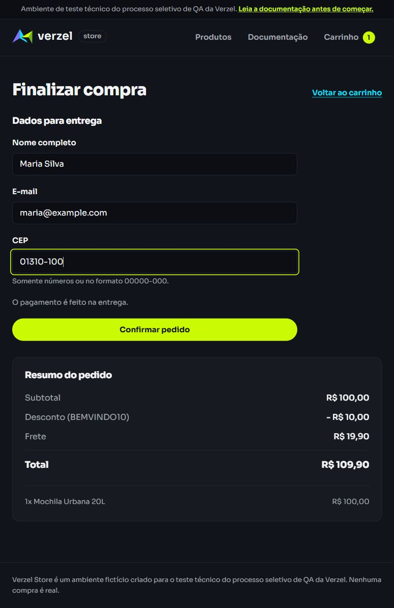 |  |

| Etapa | Data e hora | Captura |
| --- | --- | --- |
| Carrinho antes do cupom | 07/10 10:20:09 | [CT-012-UI-03-cupom-antes.png](../evidencias/execucao-2026-10-07/CT-012-UI-03-cupom-antes.png) |
| Cupom antes de aplicar | 07/10 10:20:09 | [CT-012-UI-03-cupom-preenchido.png](../evidencias/execucao-2026-10-07/CT-012-UI-03-cupom-preenchido.png) |
| Cupom aplicado | 07/10 10:20:09 | [CT-012-UI-03-cupom-depois.png](../evidencias/execucao-2026-10-07/CT-012-UI-03-cupom-depois.png) |
| Resumo antes do checkout | 07/10 10:20:09 | [CT-012-UI-03-carrinho-antes-checkout.png](../evidencias/execucao-2026-10-07/CT-012-UI-03-carrinho-antes-checkout.png) |
| Formulário vazio e resumo | 07/10 10:20:10 | [CT-012-UI-03-checkout-antes-preencher.png](../evidencias/execucao-2026-10-07/CT-012-UI-03-checkout-antes-preencher.png) |
| Dados preenchidos antes de confirmar | 07/10 10:20:10 | [CT-012-UI-03-checkout-depois-preencher.png](../evidencias/execucao-2026-10-07/CT-012-UI-03-checkout-depois-preencher.png) |
| Pedido confirmado com valores preservados | 07/10 10:20:10 | [CT-012-UI-03-pedido-depois-confirmar.png](../evidencias/execucao-2026-10-07/CT-012-UI-03-pedido-depois-confirmar.png) |

## EV-027

**CT-012-UI-04 — pedido válido.**

Comparativo e etapas

**CT-012-UI-04 — Aprovado.** 07/10 10:20:36 (UTC-04:00).

| Antes da ação | Depois da ação |
| --- | --- |
|  | 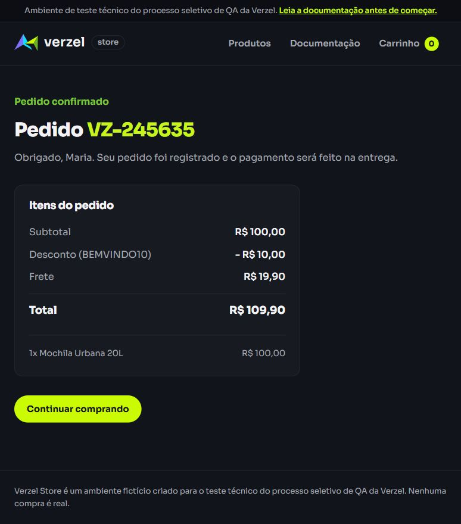 |

| Etapa | Data e hora | Captura |
| --- | --- | --- |
| Carrinho antes do cupom | 07/10 10:20:11 | [CT-012-UI-04-cupom-antes.png](../evidencias/execucao-2026-10-07/CT-012-UI-04-cupom-antes.png) |
| Cupom antes de aplicar | 07/10 10:20:11 | [CT-012-UI-04-cupom-preenchido.png](../evidencias/execucao-2026-10-07/CT-012-UI-04-cupom-preenchido.png) |
| Cupom aplicado | 07/10 10:20:12 | [CT-012-UI-04-cupom-depois.png](../evidencias/execucao-2026-10-07/CT-012-UI-04-cupom-depois.png) |
| Resumo antes do checkout | 07/10 10:20:12 | [CT-012-UI-04-carrinho-antes-checkout.png](../evidencias/execucao-2026-10-07/CT-012-UI-04-carrinho-antes-checkout.png) |
| Checkout com cupom e campos vazios | 07/10 10:20:35 | [CT-012-UI-04-checkout-antes-preencher.png](../evidencias/execucao-2026-10-07/CT-012-UI-04-checkout-antes-preencher.png) |
| CEP sem hífen e dados válidos antes de confirmar | 07/10 10:20:35 | [CT-012-UI-04-checkout-depois-preencher.png](../evidencias/execucao-2026-10-07/CT-012-UI-04-checkout-depois-preencher.png) |
| Pedido com cupom e CEP sem hífen confirmado | 07/10 10:20:36 | [CT-012-UI-04-pedido-depois-confirmar.png](../evidencias/execucao-2026-10-07/CT-012-UI-04-pedido-depois-confirmar.png) |

## EV-028

**CT-013 — nome sem sobrenome.**

Comparativo e etapas

**CT-013-UI-nome-sem-sobrenome — Aprovado.** 07/10 10:21:39 (UTC-04:00).

| Antes da ação | Depois da ação |
| --- | --- |
|  | 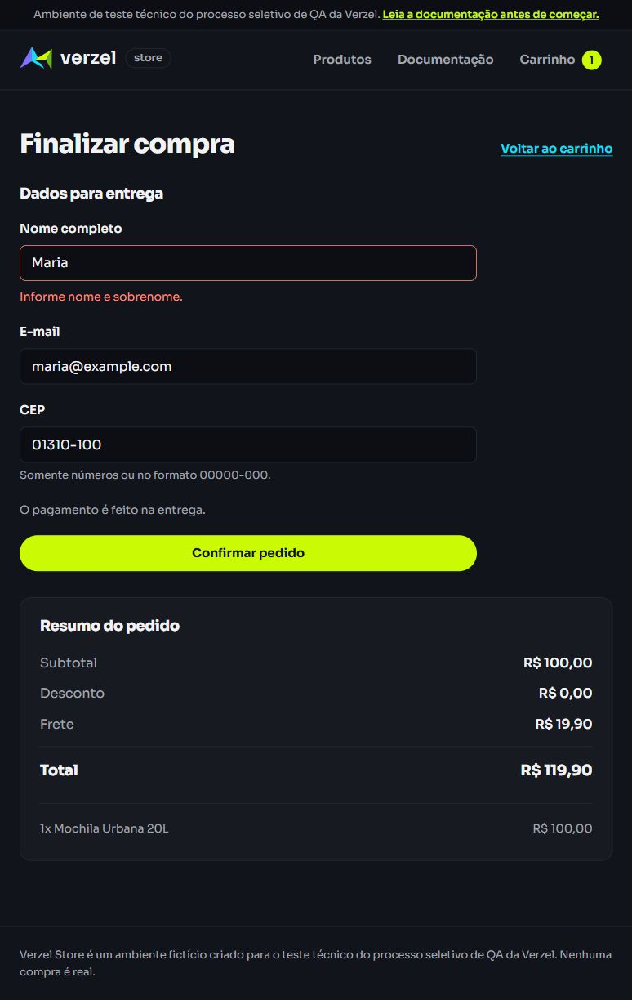 |

[Após corrigir o campo](../evidencias/execucao-2026-10-07/CT-013-nome-sem-sobrenome-depois-corrigir.png).

| Etapa | Data e hora | Captura |
| --- | --- | --- |
| Uma mochila sem cupom antes das validações | 07/10 10:21:38 | [CT-013-carrinho-antes-checkout.png](../evidencias/execucao-2026-10-07/CT-013-carrinho-antes-checkout.png) |
| Formulário vazio | 07/10 10:21:39 | [CT-013-nome-sem-sobrenome-formulario-antes.png](../evidencias/execucao-2026-10-07/CT-013-nome-sem-sobrenome-formulario-antes.png) |
| Nome sem sobrenome; demais campos válidos | 07/10 10:21:39 | [CT-013-nome-sem-sobrenome-antes-confirmar.png](../evidencias/execucao-2026-10-07/CT-013-nome-sem-sobrenome-antes-confirmar.png) |
| Confirmação impedida e erro do nome | 07/10 10:21:39 | [CT-013-nome-sem-sobrenome-depois-confirmar.png](../evidencias/execucao-2026-10-07/CT-013-nome-sem-sobrenome-depois-confirmar.png) |
| Nome corrigido; formulário permanece editável | 07/10 10:21:39 | [CT-013-nome-sem-sobrenome-depois-corrigir.png](../evidencias/execucao-2026-10-07/CT-013-nome-sem-sobrenome-depois-corrigir.png) |

## EV-029

**CT-013 — email sem arroba.**

Comparativo e etapas

**CT-013-UI-email-sem-arroba — Aprovado.** 07/10 10:22:22 (UTC-04:00).

| Antes da ação | Depois da ação |
| --- | --- |
|  |  |

[Após corrigir o campo](../evidencias/execucao-2026-10-07/CT-013-email-sem-arroba-depois-corrigir.png).

| Etapa | Data e hora | Captura |
| --- | --- | --- |
| Preparação: carrinho anterior | 07/10 10:22:20 | [CT-013-email-sem-arroba-carrinho-antes-esvaziar.png](../evidencias/execucao-2026-10-07/CT-013-email-sem-arroba-carrinho-antes-esvaziar.png) |
| Pré-condição: carrinho vazio | 07/10 10:22:20 | [CT-013-email-sem-arroba-carrinho-vazio.png](../evidencias/execucao-2026-10-07/CT-013-email-sem-arroba-carrinho-vazio.png) |
| Preparação: uma mochila sem cupom | 07/10 10:22:21 | [CT-013-email-sem-arroba-carrinho-depois-adicionar.png](../evidencias/execucao-2026-10-07/CT-013-email-sem-arroba-carrinho-depois-adicionar.png) |
| Formulário vazio | 07/10 10:22:21 | [CT-013-email-sem-arroba-formulario-antes.png](../evidencias/execucao-2026-10-07/CT-013-email-sem-arroba-formulario-antes.png) |
| E-mail sem arroba; outros campos válidos | 07/10 10:22:21 | [CT-013-email-sem-arroba-antes-confirmar.png](../evidencias/execucao-2026-10-07/CT-013-email-sem-arroba-antes-confirmar.png) |
| E-mail inválido rejeitado pela interface | 07/10 10:22:22 | [CT-013-email-sem-arroba-depois-confirmar.png](../evidencias/execucao-2026-10-07/CT-013-email-sem-arroba-depois-confirmar.png) |
| Mensagem de validação do e-mail | 07/10 10:22:22 | [CT-013-email-sem-arroba-mensagem.png](../evidencias/execucao-2026-10-07/CT-013-email-sem-arroba-mensagem.png) |
| E-mail corrigido no formulário | 07/10 10:22:22 | [CT-013-email-sem-arroba-depois-corrigir.png](../evidencias/execucao-2026-10-07/CT-013-email-sem-arroba-depois-corrigir.png) |

## EV-030

**CT-013 — cep sete digitos.**

Comparativo e etapas

**CT-013-UI-cep-sete-digitos — Aprovado.** 07/10 10:23:30 (UTC-04:00).

| Antes da ação | Depois da ação |
| --- | --- |
|  | 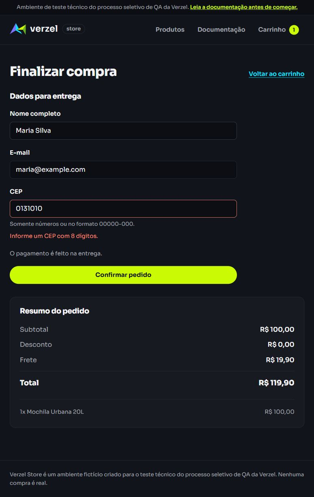 |

[Após corrigir o campo](../evidencias/execucao-2026-10-07/CT-013-cep-sete-digitos-depois-corrigir.png).

| Etapa | Data e hora | Captura |
| --- | --- | --- |
| Preparação: carrinho anterior | 07/10 10:23:28 | [CT-013-cep-sete-digitos-carrinho-antes-esvaziar.png](../evidencias/execucao-2026-10-07/CT-013-cep-sete-digitos-carrinho-antes-esvaziar.png) |
| Pré-condição: carrinho vazio | 07/10 10:23:28 | [CT-013-cep-sete-digitos-carrinho-vazio.png](../evidencias/execucao-2026-10-07/CT-013-cep-sete-digitos-carrinho-vazio.png) |
| Preparação: uma mochila sem cupom | 07/10 10:23:29 | [CT-013-cep-sete-digitos-carrinho-depois-adicionar.png](../evidencias/execucao-2026-10-07/CT-013-cep-sete-digitos-carrinho-depois-adicionar.png) |
| Formulário vazio | 07/10 10:23:30 | [CT-013-cep-sete-digitos-formulario-antes.png](../evidencias/execucao-2026-10-07/CT-013-cep-sete-digitos-formulario-antes.png) |
| Um campo inválido; demais campos válidos | 07/10 10:23:30 | [CT-013-cep-sete-digitos-antes-confirmar.png](../evidencias/execucao-2026-10-07/CT-013-cep-sete-digitos-antes-confirmar.png) |
| Erro do campo e pedido não confirmado | 07/10 10:23:30 | [CT-013-cep-sete-digitos-depois-confirmar.png](../evidencias/execucao-2026-10-07/CT-013-cep-sete-digitos-depois-confirmar.png) |
| Campo corrigido e formulário editável | 07/10 10:23:30 | [CT-013-cep-sete-digitos-depois-corrigir.png](../evidencias/execucao-2026-10-07/CT-013-cep-sete-digitos-depois-corrigir.png) |

## EV-031

**CT-013 — cep nove digitos.**

Comparativo e etapas

**CT-013-UI-cep-nove-digitos — Aprovado.** 07/10 10:23:33 (UTC-04:00).

| Antes da ação | Depois da ação |
| --- | --- |
|  |  |

[Após corrigir o campo](../evidencias/execucao-2026-10-07/CT-013-cep-nove-digitos-depois-corrigir.png).

| Etapa | Data e hora | Captura |
| --- | --- | --- |
| Preparação: carrinho anterior | 07/10 10:23:31 | [CT-013-cep-nove-digitos-carrinho-antes-esvaziar.png](../evidencias/execucao-2026-10-07/CT-013-cep-nove-digitos-carrinho-antes-esvaziar.png) |
| Pré-condição: carrinho vazio | 07/10 10:23:31 | [CT-013-cep-nove-digitos-carrinho-vazio.png](../evidencias/execucao-2026-10-07/CT-013-cep-nove-digitos-carrinho-vazio.png) |
| Preparação: uma mochila sem cupom | 07/10 10:23:32 | [CT-013-cep-nove-digitos-carrinho-depois-adicionar.png](../evidencias/execucao-2026-10-07/CT-013-cep-nove-digitos-carrinho-depois-adicionar.png) |
| Formulário vazio | 07/10 10:23:32 | [CT-013-cep-nove-digitos-formulario-antes.png](../evidencias/execucao-2026-10-07/CT-013-cep-nove-digitos-formulario-antes.png) |
| Um campo inválido; demais campos válidos | 07/10 10:23:33 | [CT-013-cep-nove-digitos-antes-confirmar.png](../evidencias/execucao-2026-10-07/CT-013-cep-nove-digitos-antes-confirmar.png) |
| Erro do campo e pedido não confirmado | 07/10 10:23:33 | [CT-013-cep-nove-digitos-depois-confirmar.png](../evidencias/execucao-2026-10-07/CT-013-cep-nove-digitos-depois-confirmar.png) |
| Campo corrigido e formulário editável | 07/10 10:23:33 | [CT-013-cep-nove-digitos-depois-corrigir.png](../evidencias/execucao-2026-10-07/CT-013-cep-nove-digitos-depois-corrigir.png) |

## EV-032

**CT-013 — nome vazio.**

Comparativo e etapas

**CT-013-UI-nome-vazio — Aprovado.** 07/10 10:25:03 (UTC-04:00).

| Antes da ação | Depois da ação |
| --- | --- |
|  |  |

[Após corrigir o campo](../evidencias/execucao-2026-10-07/CT-013-nome-vazio-depois-corrigir.png).

| Etapa | Data e hora | Captura |
| --- | --- | --- |
| Preparação: carrinho anterior | 07/10 10:24:58 | [CT-013-nome-vazio-carrinho-antes-esvaziar.png](../evidencias/execucao-2026-10-07/CT-013-nome-vazio-carrinho-antes-esvaziar.png) |
| Pré-condição: carrinho vazio | 07/10 10:24:58 | [CT-013-nome-vazio-carrinho-vazio.png](../evidencias/execucao-2026-10-07/CT-013-nome-vazio-carrinho-vazio.png) |
| Preparação: uma mochila sem cupom | 07/10 10:25:01 | [CT-013-nome-vazio-carrinho-depois-adicionar.png](../evidencias/execucao-2026-10-07/CT-013-nome-vazio-carrinho-depois-adicionar.png) |
| Formulário vazio | 07/10 10:25:02 | [CT-013-nome-vazio-formulario-antes.png](../evidencias/execucao-2026-10-07/CT-013-nome-vazio-formulario-antes.png) |
| Campo obrigatório vazio; demais campos válidos | 07/10 10:25:02 | [CT-013-nome-vazio-antes-confirmar.png](../evidencias/execucao-2026-10-07/CT-013-nome-vazio-antes-confirmar.png) |
| Campo vazio rejeitado | 07/10 10:25:03 | [CT-013-nome-vazio-depois-confirmar.png](../evidencias/execucao-2026-10-07/CT-013-nome-vazio-depois-confirmar.png) |
| Campo obrigatório preenchido e formulário editável | 07/10 10:25:03 | [CT-013-nome-vazio-depois-corrigir.png](../evidencias/execucao-2026-10-07/CT-013-nome-vazio-depois-corrigir.png) |

## EV-033

**CT-013 — email vazio.**

Comparativo e etapas

**CT-013-UI-email-vazio — Aprovado.** 07/10 10:29:46 (UTC-04:00).

| Antes da ação | Depois da ação |
| --- | --- |
| 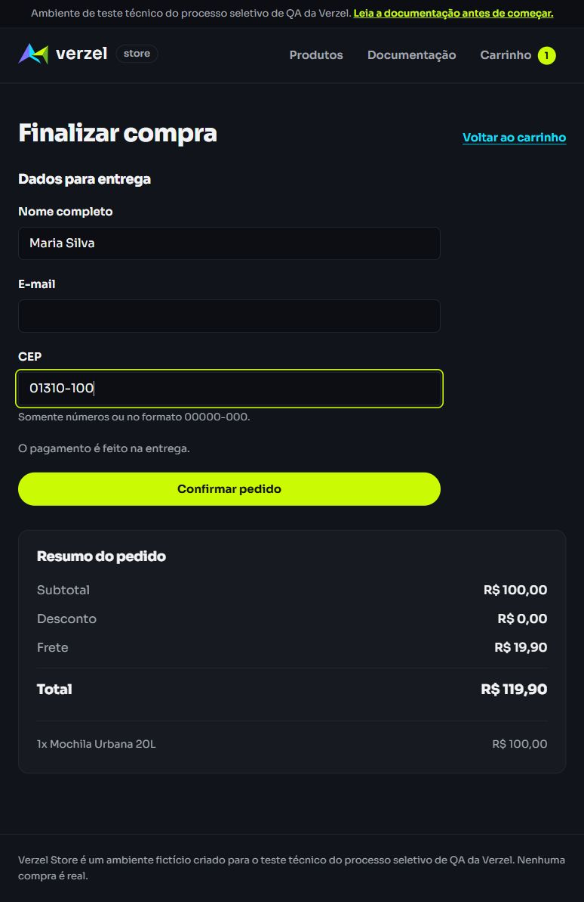 | 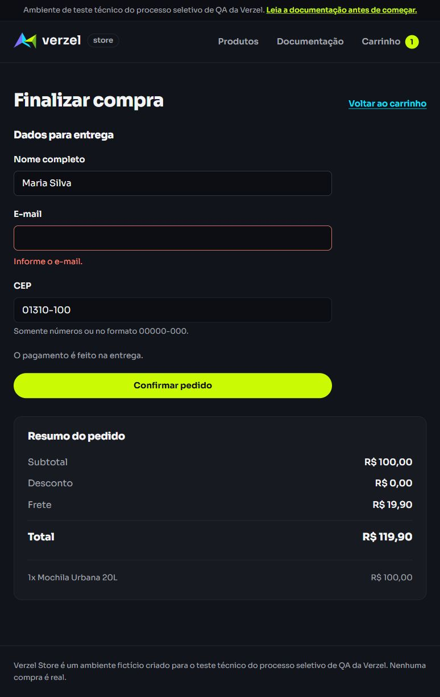 |

[Após corrigir o campo](../evidencias/execucao-2026-10-07/CT-013-email-vazio-depois-corrigir.png).

| Etapa | Data e hora | Captura |
| --- | --- | --- |
| Preparação: carrinho antes de esvaziar | 07/10 10:29:41 | [CT-013-email-vazio-carrinho-antes-esvaziar.png](../evidencias/execucao-2026-10-07/CT-013-email-vazio-carrinho-antes-esvaziar.png) |
| Preparação: carrinho vazio | 07/10 10:29:41 | [CT-013-email-vazio-carrinho-vazio.png](../evidencias/execucao-2026-10-07/CT-013-email-vazio-carrinho-vazio.png) |
| Preparação: vitrine antes de adicionar mochila | 07/10 10:29:42 | [CT-013-email-vazio-vitrine-antes-adicionar.png](../evidencias/execucao-2026-10-07/CT-013-email-vazio-vitrine-antes-adicionar.png) |
| Preparação: mochila adicionada ao carrinho pela vitrine | 07/10 10:29:44 | [CT-013-email-vazio-vitrine-depois-adicionar.png](../evidencias/execucao-2026-10-07/CT-013-email-vazio-vitrine-depois-adicionar.png) |
| Preparação: uma mochila sem cupom | 07/10 10:29:44 | [CT-013-email-vazio-carrinho-depois-adicionar.png](../evidencias/execucao-2026-10-07/CT-013-email-vazio-carrinho-depois-adicionar.png) |
| Formulário vazio; resumo completo | 07/10 10:29:45 | [CT-013-email-vazio-formulario-antes.png](../evidencias/execucao-2026-10-07/CT-013-email-vazio-formulario-antes.png) |
| E-mail vazio; demais dados válidos | 07/10 10:29:45 | [CT-013-email-vazio-antes-confirmar.png](../evidencias/execucao-2026-10-07/CT-013-email-vazio-antes-confirmar.png) |
| E-mail obrigatório rejeitado | 07/10 10:29:45 | [CT-013-email-vazio-depois-confirmar.png](../evidencias/execucao-2026-10-07/CT-013-email-vazio-depois-confirmar.png) |
| E-mail corrigido; formulário editável | 07/10 10:29:46 | [CT-013-email-vazio-depois-corrigir.png](../evidencias/execucao-2026-10-07/CT-013-email-vazio-depois-corrigir.png) |

## EV-034

**CT-013 — cep vazio.**

Comparativo e etapas

**CT-013-UI-cep-vazio — Aprovado.** 07/10 10:30:08 (UTC-04:00).

| Antes da ação | Depois da ação |
| --- | --- |
|  |  |

[Após corrigir o campo](../evidencias/execucao-2026-10-07/CT-013-cep-vazio-depois-corrigir.png).

| Etapa | Data e hora | Captura |
| --- | --- | --- |
| Preparação: carrinho antes de esvaziar | 07/10 10:30:04 | [CT-013-cep-vazio-carrinho-antes-esvaziar.png](../evidencias/execucao-2026-10-07/CT-013-cep-vazio-carrinho-antes-esvaziar.png) |
| Preparação: carrinho vazio | 07/10 10:30:04 | [CT-013-cep-vazio-carrinho-vazio.png](../evidencias/execucao-2026-10-07/CT-013-cep-vazio-carrinho-vazio.png) |
| Preparação: vitrine antes de adicionar mochila | 07/10 10:30:05 | [CT-013-cep-vazio-vitrine-antes-adicionar.png](../evidencias/execucao-2026-10-07/CT-013-cep-vazio-vitrine-antes-adicionar.png) |
| Preparação: mochila adicionada ao carrinho pela vitrine | 07/10 10:30:07 | [CT-013-cep-vazio-vitrine-depois-adicionar.png](../evidencias/execucao-2026-10-07/CT-013-cep-vazio-vitrine-depois-adicionar.png) |
| Preparação: uma mochila sem cupom | 07/10 10:30:07 | [CT-013-cep-vazio-carrinho-depois-adicionar.png](../evidencias/execucao-2026-10-07/CT-013-cep-vazio-carrinho-depois-adicionar.png) |
| Formulário vazio; resumo completo | 07/10 10:30:08 | [CT-013-cep-vazio-formulario-antes.png](../evidencias/execucao-2026-10-07/CT-013-cep-vazio-formulario-antes.png) |
| CEP vazio; demais dados válidos | 07/10 10:30:08 | [CT-013-cep-vazio-antes-confirmar.png](../evidencias/execucao-2026-10-07/CT-013-cep-vazio-antes-confirmar.png) |
| CEP obrigatório rejeitado | 07/10 10:30:08 | [CT-013-cep-vazio-depois-confirmar.png](../evidencias/execucao-2026-10-07/CT-013-cep-vazio-depois-confirmar.png) |
| CEP corrigido; formulário editável | 07/10 10:30:08 | [CT-013-cep-vazio-depois-corrigir.png](../evidencias/execucao-2026-10-07/CT-013-cep-vazio-depois-corrigir.png) |

## EV-035

**API — 19 variações executadas em 07/10/2026.** 18 aprovadas e uma reprovada: CT-009-API-6P, BUG-002.

[Requisições, respostas e verificações](../evidencias/execucao-2026-10-07/api-pendentes.json).

## EV-036

**EXP-01 — exploração de carrinho e checkout.** 10:28:28–10:30:09 (UTC-04:00); 101 segundos; nenhum novo defeito.

Comparativos da exploração

**Aplicar cupom.**

| Antes | Depois |
| --- | --- |
| 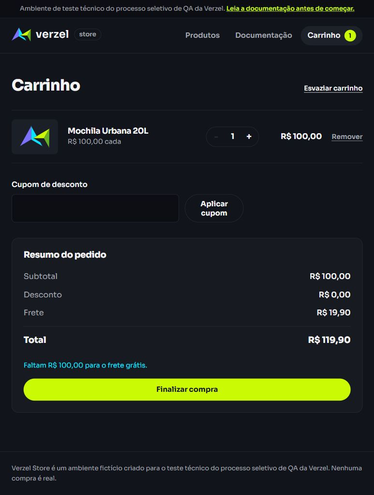 |  |

**Esvaziar carrinho.**

| Antes | Depois |
| --- | --- |
|  | 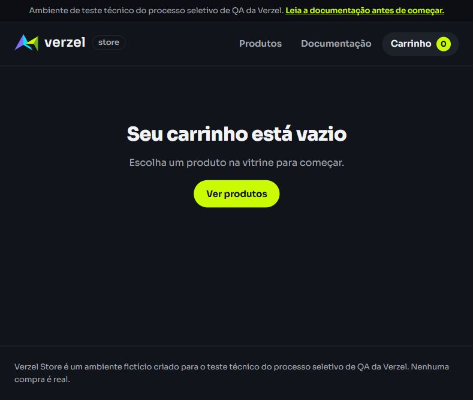 |

**Carrinho da nova aba.**

| Antes | Depois |
| --- | --- |
| 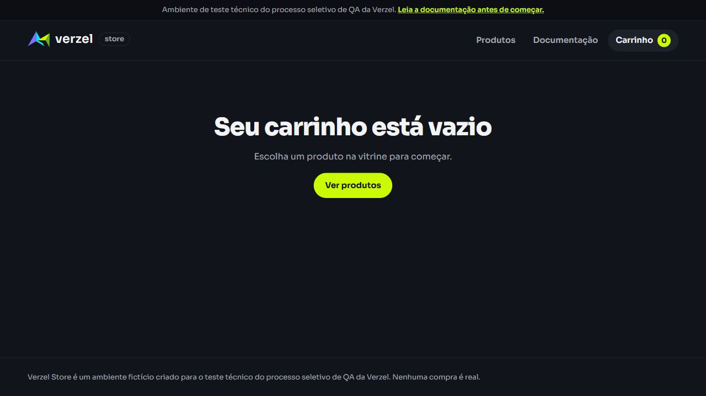 | 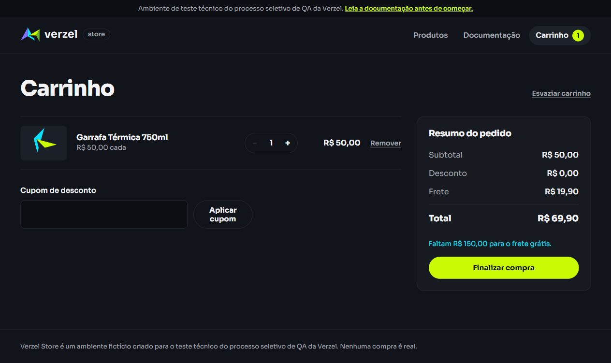 |

**Carrinho original preservado.**

| Antes | Depois |
| --- | --- |
|  |  |

**Reenviar dados corrigidos.**

| Antes | Depois |
| --- | --- |
|  |  |

| Etapa | Data e hora | Captura |
| --- | --- | --- |
| Exploração: carrinho com uma mochila, sem cupom | 07/10 10:28:28 | [EXP-01-carrinho-antes-cupom.png](../evidencias/execucao-2026-10-07/EXP-01-carrinho-antes-cupom.png) |
| Exploração: cupom preenchido antes de aplicar | 07/10 10:28:29 | [EXP-01-cupom-preenchido.png](../evidencias/execucao-2026-10-07/EXP-01-cupom-preenchido.png) |
| Exploração: cupom aplicado | 07/10 10:28:29 | [EXP-01-carrinho-depois-cupom.png](../evidencias/execucao-2026-10-07/EXP-01-carrinho-depois-cupom.png) |
| Exploração: carrinho com cupom antes de esvaziar | 07/10 10:28:39 | [EXP-01-antes-esvaziar.png](../evidencias/execucao-2026-10-07/EXP-01-antes-esvaziar.png) |
| Exploração: carrinho vazio após limpar | 07/10 10:28:40 | [EXP-01-depois-esvaziar.png](../evidencias/execucao-2026-10-07/EXP-01-depois-esvaziar.png) |
| Exploração: vitrine antes de readicionar produto | 07/10 10:28:41 | [EXP-01-vitrine-antes-readicionar.png](../evidencias/execucao-2026-10-07/EXP-01-vitrine-antes-readicionar.png) |
| Exploração: produto readicionado | 07/10 10:28:43 | [EXP-01-vitrine-depois-readicionar.png](../evidencias/execucao-2026-10-07/EXP-01-vitrine-depois-readicionar.png) |
| Exploração: produto readicionado sem cupom residual | 07/10 10:28:43 | [EXP-01-depois-readicionar.png](../evidencias/execucao-2026-10-07/EXP-01-depois-readicionar.png) |
| Exploração: aba original com uma mochila | 07/10 10:28:49 | [EXP-01-aba-original-antes.png](../evidencias/execucao-2026-10-07/EXP-01-aba-original-antes.png) |
| Exploração: nova aba com carrinho vazio | 07/10 10:29:05 | [EXP-01-aba-nova-antes.png](../evidencias/execucao-2026-10-07/EXP-01-aba-nova-antes.png) |
| Exploração: nova aba antes de adicionar garrafa | 07/10 10:29:05 | [EXP-01-aba-nova-vitrine-antes.png](../evidencias/execucao-2026-10-07/EXP-01-aba-nova-vitrine-antes.png) |
| Exploração: garrafa adicionada somente na nova aba | 07/10 10:29:06 | [EXP-01-aba-nova-vitrine-depois.png](../evidencias/execucao-2026-10-07/EXP-01-aba-nova-vitrine-depois.png) |
| Exploração: nova aba com garrafa e total 69,90 | 07/10 10:29:07 | [EXP-01-aba-nova-depois.png](../evidencias/execucao-2026-10-07/EXP-01-aba-nova-depois.png) |
| Exploração: aba original preserva mochila e total 119,90 | 07/10 10:29:07 | [EXP-01-aba-original-depois.png](../evidencias/execucao-2026-10-07/EXP-01-aba-original-depois.png) |
| Exploração: dados corrigidos antes de reenviar | 07/10 10:30:09 | [EXP-01-checkout-antes-reenviar.png](../evidencias/execucao-2026-10-07/EXP-01-checkout-antes-reenviar.png) |
| Exploração: confirmação após corrigir CEP | 07/10 10:30:09 | [EXP-01-checkout-depois-reenviar.png](../evidencias/execucao-2026-10-07/EXP-01-checkout-depois-reenviar.png) |

[Registro da sessão](../evidencias/execucao-2026-10-07/exploratoria.json).

## Registros completos

- [Dados, esperado, obtido e status de UI](../evidencias/execucao-2026-10-07/ui-resultados.json).
- [Manifesto das capturas com etapa e horário UTC](../evidencias/execucao-2026-10-07/ui-capturas.json).

## Comparativos complementares em 07/10/2026

Sete casos reexecutados para obter comparativos próprios. São reproduções dos casos existentes; não alteram a contagem de 70 casos, os 63 aprovados ou os 7 reprovados.

[Dados das reexecuções](../evidencias/revisao-2026-10-07/ui-complementos.json) · [Manifesto de 20 capturas](../evidencias/revisao-2026-10-07/capturas.json).

## EV-037

**CT-002-minusculas — Aprovado.** 07/10 11:19:40 (UTC-04:00).

| Antes da ação | Depois da ação |
| --- | --- |
|  |  |

[Campo preenchido](../evidencias/revisao-2026-10-07/CT-002-minusculas-preenchido.png).

| Etapa | Data e hora UTC | Captura |
| --- | --- | --- |
| Antes de aplicar bemvindo10 | 2026-10-07T15:19:39.529Z | [CT-002-minusculas-antes.png](../evidencias/revisao-2026-10-07/CT-002-minusculas-antes.png) |
| bemvindo10 preenchido | 2026-10-07T15:19:39.694Z | [CT-002-minusculas-preenchido.png](../evidencias/revisao-2026-10-07/CT-002-minusculas-preenchido.png) |
| Cupom normalizado para BEMVINDO10 | 2026-10-07T15:19:40.146Z | [CT-002-minusculas-depois.png](../evidencias/revisao-2026-10-07/CT-002-minusculas-depois.png) |

[Registro individual](../evidencias/cenarios/CT-002-minusculas/registro.json).

## EV-038

**CT-006-UI-sem-cupom — Reprovado.** 07/10 11:19:59 (UTC-04:00).

| Antes da ação | Depois da ação |
| --- | --- |
|  | 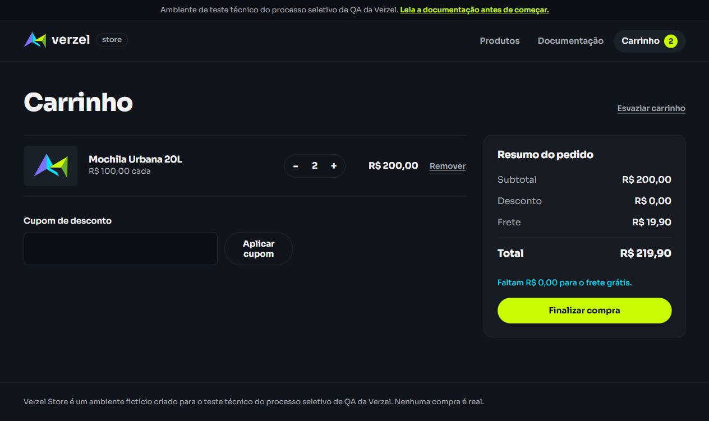 |

| Etapa | Data e hora UTC | Captura |
| --- | --- | --- |
| Uma mochila sem cupom antes de aumentar | 2026-10-07T15:19:59.008Z | [CT-006-UI-sem-cupom-antes.png](../evidencias/revisao-2026-10-07/CT-006-UI-sem-cupom-antes.png) |
| Subtotal 200,00 sem cupom; frete cobrado | 2026-10-07T15:19:59.438Z | [CT-006-UI-sem-cupom-depois.png](../evidencias/revisao-2026-10-07/CT-006-UI-sem-cupom-depois.png) |

[Registro individual](../evidencias/cenarios/CT-006-UI-sem-cupom/registro.json).

## EV-039

**CT-006-UI-com-cupom — Reprovado.** 07/10 11:20:00 (UTC-04:00).

| Antes da ação | Depois da ação |
| --- | --- |
|  | 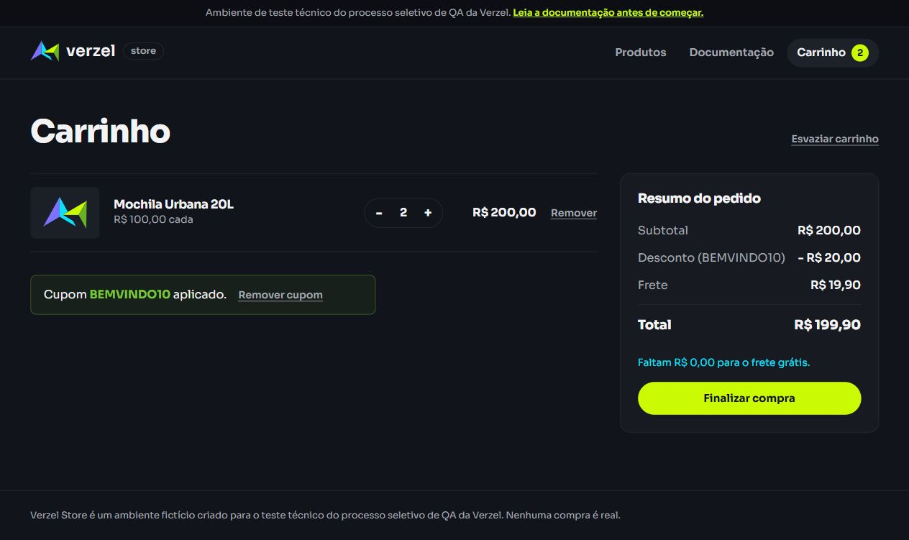 |

[Campo preenchido](../evidencias/revisao-2026-10-07/CT-006-UI-com-cupom-preenchido.png).

| Etapa | Data e hora UTC | Captura |
| --- | --- | --- |
| Subtotal 200,00 antes de aplicar cupom | 2026-10-07T15:19:59.571Z | [CT-006-UI-com-cupom-antes.png](../evidencias/revisao-2026-10-07/CT-006-UI-com-cupom-antes.png) |
| BEMVINDO10 preenchido | 2026-10-07T15:19:59.730Z | [CT-006-UI-com-cupom-preenchido.png](../evidencias/revisao-2026-10-07/CT-006-UI-com-cupom-preenchido.png) |
| Subtotal 200,00 com cupom; frete cobrado | 2026-10-07T15:20:00.192Z | [CT-006-UI-com-cupom-depois.png](../evidencias/revisao-2026-10-07/CT-006-UI-com-cupom-depois.png) |

[Registro individual](../evidencias/cenarios/CT-006-UI-com-cupom/registro.json).

## EV-040

**CT-007-UI-jaqueta — Aprovado.** 07/10 11:21:02 (UTC-04:00).

| Antes da ação | Depois da ação |
| --- | --- |
| 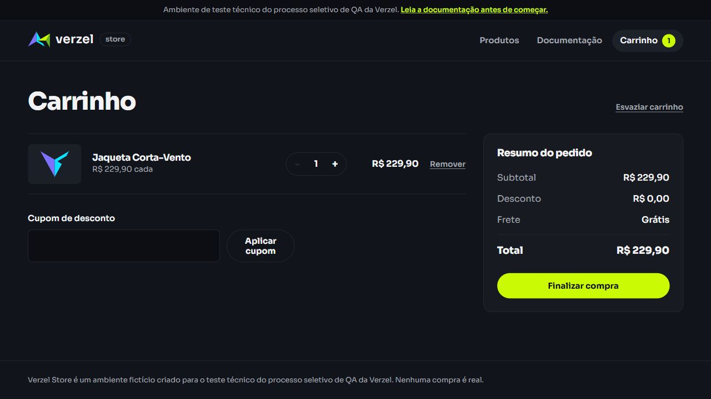 | 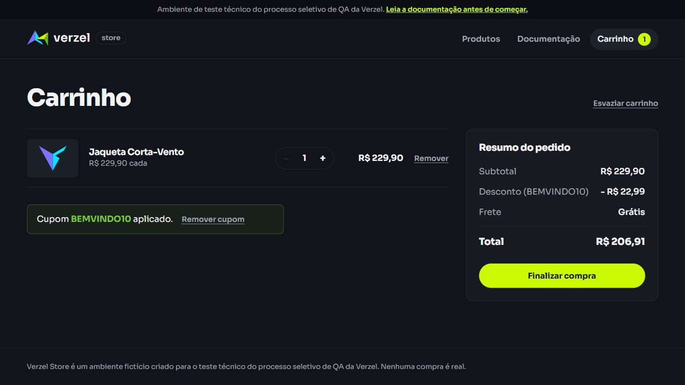 |

[Campo preenchido](../evidencias/revisao-2026-10-07/CT-007-UI-jaqueta-preenchido.png).

| Etapa | Data e hora UTC | Captura |
| --- | --- | --- |
| Jaqueta sem cupom | 2026-10-07T15:21:02.040Z | [CT-007-UI-jaqueta-antes.png](../evidencias/revisao-2026-10-07/CT-007-UI-jaqueta-antes.png) |
| BEMVINDO10 preenchido | 2026-10-07T15:21:02.154Z | [CT-007-UI-jaqueta-preenchido.png](../evidencias/revisao-2026-10-07/CT-007-UI-jaqueta-preenchido.png) |
| Jaqueta com cupom; frete grátis | 2026-10-07T15:21:02.556Z | [CT-007-UI-jaqueta-depois.png](../evidencias/revisao-2026-10-07/CT-007-UI-jaqueta-depois.png) |

[Registro individual](../evidencias/cenarios/CT-007-UI-jaqueta/registro.json).

## EV-041

**CT-007-UI-camiseta-garrafas — Aprovado.** 07/10 11:21:14 (UTC-04:00).

| Antes da ação | Depois da ação |
| --- | --- |
| 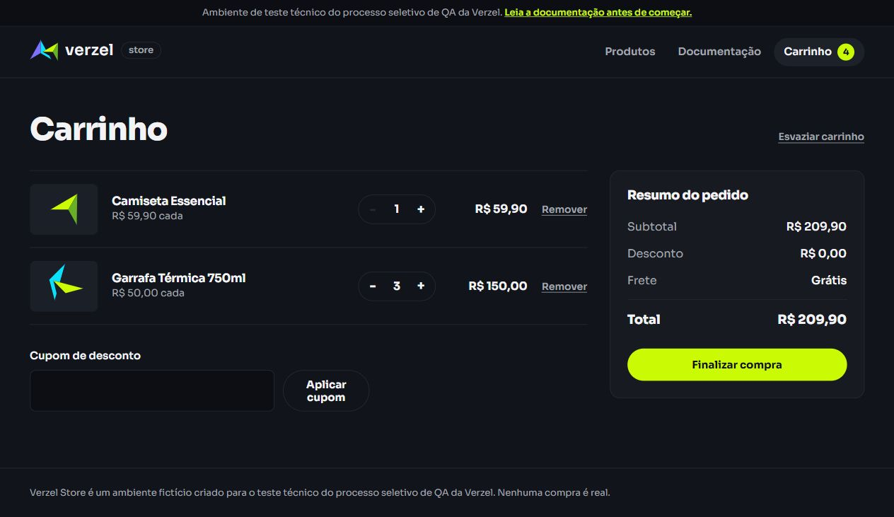 | 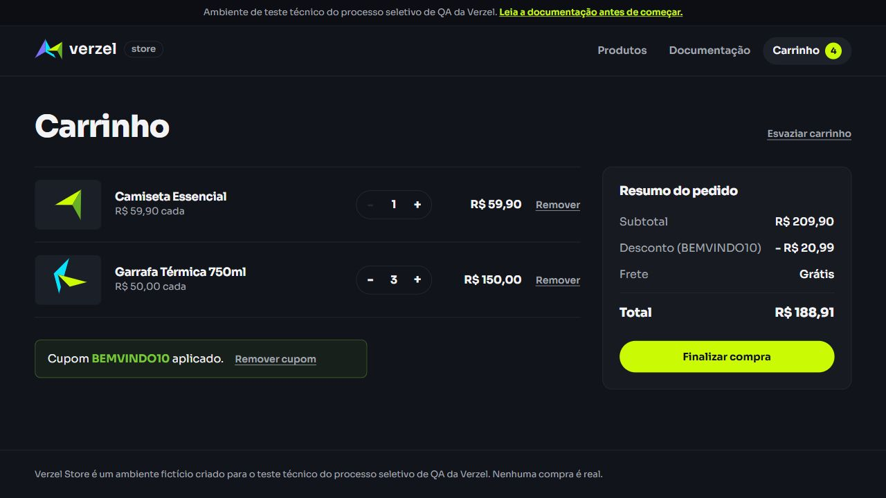 |

[Campo preenchido](../evidencias/revisao-2026-10-07/CT-007-UI-camiseta-garrafas-preenchido.png).

| Etapa | Data e hora UTC | Captura |
| --- | --- | --- |
| Subtotal 209,90 sem cupom | 2026-10-07T15:21:14.019Z | [CT-007-UI-camiseta-garrafas-antes.png](../evidencias/revisao-2026-10-07/CT-007-UI-camiseta-garrafas-antes.png) |
| BEMVINDO10 preenchido | 2026-10-07T15:21:14.184Z | [CT-007-UI-camiseta-garrafas-preenchido.png](../evidencias/revisao-2026-10-07/CT-007-UI-camiseta-garrafas-preenchido.png) |
| Frete grátis mantido antes do desconto | 2026-10-07T15:21:14.601Z | [CT-007-UI-camiseta-garrafas-depois.png](../evidencias/revisao-2026-10-07/CT-007-UI-camiseta-garrafas-depois.png) |

[Registro individual](../evidencias/cenarios/CT-007-UI-camiseta-garrafas/registro.json).

## EV-042

**CT-008-UI — Aprovado.** 07/10 11:21:32 (UTC-04:00).

| Antes da ação | Depois da ação |
| --- | --- |
| 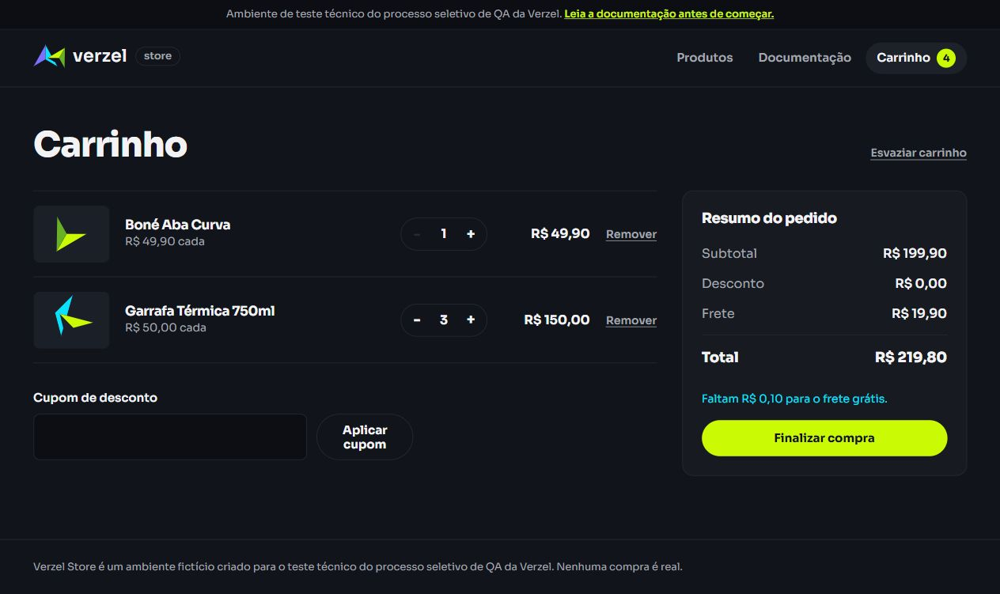 | 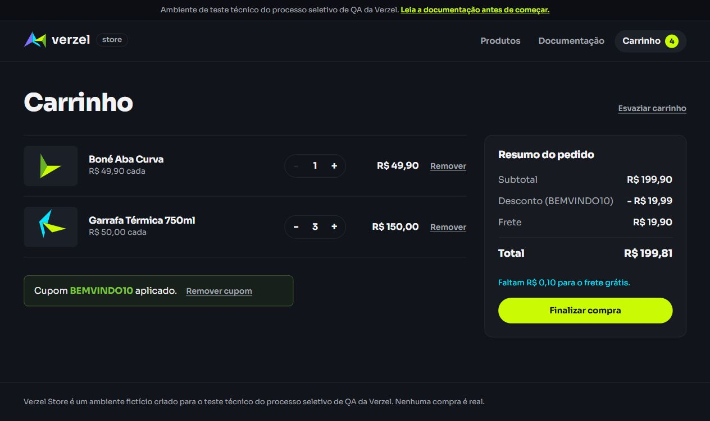 |

[Campo preenchido](../evidencias/revisao-2026-10-07/CT-008-UI-preenchido.png).

| Etapa | Data e hora UTC | Captura |
| --- | --- | --- |
| Subtotal 199,90 sem cupom | 2026-10-07T15:21:31.983Z | [CT-008-UI-antes.png](../evidencias/revisao-2026-10-07/CT-008-UI-antes.png) |
| BEMVINDO10 preenchido | 2026-10-07T15:21:32.139Z | [CT-008-UI-preenchido.png](../evidencias/revisao-2026-10-07/CT-008-UI-preenchido.png) |
| Frete 19,90; faltante 0,10 | 2026-10-07T15:21:32.564Z | [CT-008-UI-depois.png](../evidencias/revisao-2026-10-07/CT-008-UI-depois.png) |

[Registro individual](../evidencias/cenarios/CT-008-UI/registro.json).

## EV-043

**CT-011-UI — Aprovado.** 07/10 11:21:33 (UTC-04:00).

| Antes da ação | Depois da ação |
| --- | --- |
|  |  |

[Campo preenchido](../evidencias/revisao-2026-10-07/CT-011-UI-preenchido.png).

| Etapa | Data e hora UTC | Captura |
| --- | --- | --- |
| Valores monetários antes do cupom | 2026-10-07T15:21:33.032Z | [CT-011-UI-antes.png](../evidencias/revisao-2026-10-07/CT-011-UI-antes.png) |
| BEMVINDO10 preenchido | 2026-10-07T15:21:33.180Z | [CT-011-UI-preenchido.png](../evidencias/revisao-2026-10-07/CT-011-UI-preenchido.png) |
| Preços, resumo e faltante com duas casas decimais | 2026-10-07T15:21:33.617Z | [CT-011-UI-depois.png](../evidencias/revisao-2026-10-07/CT-011-UI-depois.png) |

[Registro individual](../evidencias/cenarios/CT-011-UI/registro.json).

## EV-044 — Automação Playwright

**Data:** 07/10/2026, 13:32:20 a 13:32:43, UTC-04:00. **Resultado:** 6 aprovados e 3 falhas conhecidas esperadas; nenhuma falha inesperada.

[Registro da execução](../evidencias/automacao/2026-10-07/resultado.json) · [Índice por teste](../evidencias/automacao/2026-10-07/LEIA-ME.md).

| Teste | Resultado | Antes | Depois / resposta |
| --- | --- | --- | --- |
| AUTO-001 | Aprovado | [Sem cupom](../evidencias/automacao/2026-10-07/AUTO-001/01-antes-do-cupom.png) | [Cupom reaplicado](../evidencias/automacao/2026-10-07/AUTO-001/04-cupom-reaplicado.png) |
| AUTO-002 | Aprovado | [Sem cupom](../evidencias/automacao/2026-10-07/AUTO-002/01-antes-do-cupom.png) | [Inexistente rejeitado](../evidencias/automacao/2026-10-07/AUTO-002/02-cupom-rejeitado.png) |
| AUTO-003 | Aprovado | [Sem cupom](../evidencias/automacao/2026-10-07/AUTO-003/01-antes-do-cupom.png) | [Expirado rejeitado](../evidencias/automacao/2026-10-07/AUTO-003/02-cupom-rejeitado.png) |
| AUTO-004 | Aprovado | [Subtotal R$ 209,90](../evidencias/automacao/2026-10-07/AUTO-004/01-antes-do-cupom.png) | [Frete grátis após desconto](../evidencias/automacao/2026-10-07/AUTO-004/02-frete-gratis-apos-desconto.png) |
| AUTO-005 | Falha conhecida: BUG-001 | [Uma unidade](../evidencias/automacao/2026-10-07/AUTO-005/01-uma-unidade-com-cupom.png) | [Frete indevido em R$ 200,00](../evidencias/automacao/2026-10-07/AUTO-005/02-duas-unidades-com-cupom.png) |
| AUTO-006 | Aprovado | [Quatro unidades](../evidencias/automacao/2026-10-07/AUTO-006/01-quatro-unidades.png) | [Cinco unidades: limite](../evidencias/automacao/2026-10-07/AUTO-006/02-limite-cinco-unidades.png) e [recalcular para quatro](../evidencias/automacao/2026-10-07/AUTO-006/03-quantidade-recalculada.png) |
| AUTO-007 | Aprovado | [Checkout](../evidencias/automacao/2026-10-07/AUTO-007/01-checkout-antes-de-confirmar.png) | [CEP rejeitado](../evidencias/automacao/2026-10-07/AUTO-007/02-cep-invalido-rejeitado.png), [pedido confirmado](../evidencias/automacao/2026-10-07/AUTO-007/04-pedido-confirmado.png) e [API](../evidencias/automacao/2026-10-07/AUTO-007/pedido-confirmado.json) |
| AUTO-008 | Falha conhecida: BUG-002 | — | [Requisição e resposta do cálculo](../evidencias/automacao/2026-10-07/AUTO-008/requisicao-resposta.json) |
| AUTO-009 | Falha conhecida: BUG-002 | — | [Requisição e resposta do pedido](../evidencias/automacao/2026-10-07/AUTO-009/requisicao-resposta.json) |

Cada pasta contém somente os anexos do respectivo teste e seu `registro.json`. São 19 capturas e 3 registros de requisição/resposta. Os relatórios das próximas execuções são gerados por `npm test`; o comando `npm run test:report` abre o relatório HTML.
